# Movie Night

Movie Night is a movie sharing and reviewing platform for student filmmakers, enthusiast or anyone to share movies or short peices of film to a wide audience for critique... and maybe a little ego bump for some.

[Deployed Front End](https://movie-night-p5.herokuapp.com)

All documentation for the API and database schema can be found int he README.md file in the repository below.

[Back End Repository](https://github.com/JavaScriptJacksn/p5-api-movie)

[Deployed Back End](https://drf-movie-app.herokuapp.com)


<br>
<br>

# UX

## Purpose

For users to share movies, scenes or extracts both professional and amateur for others to see and review.

In the future, I plan to encompass a wider range of features similarly to that of Imbd, but with more emphasis on an anyone-can-contribute such as Rotten Tomatos, yet with the added benefit of student/amateur movies being encouraged.

## Goal

Movie Night's goal is to facilitate professional, student and hobby filmmakers and critics to level the playing field with all levels of cinema and TV to communicate together. 

The User Stories fall into the requirements to reach this goal.

In order to achieve this goal the site must provide CRUD functionality for Movies and Reviews
- User Stories 1,3,4,5,6,7,8

These User Stories serve the purpose to document features for development that improve UX and the greatly help the site reach it's goal
- User Stories 11, 10

Finally, these User Stories are dependent on/around the authentication features of the site, which are detailed in other User Stories.
- User Stories 2, 9, 12

## Audience

Anyone with an interest in cinema, TV, filmmaking or critiquing.

## Communication

The site uses a minimalist approach to keep engagement towards the key movie content and reviews a priority.

## User Goals

To keep users enganged and always interested in new content that's easy to locate and understand with easy an sign up and sign in feature to allow new and returning users to quickly access movie and review CRUD fucntionality.

## Future Goals

To include user profiles, messaging and 'favourites' features.

# User Stories


# Design
<hr>

Most of the UI design is build from the great foundations displated in the Code Institute Moments walkthough project, so full credit is given for the basis of the site layout. I found the Moments project served wonderfully as a base UI to work with along with the principles mentioned above. 

## Typography

The site uses the Lato font provided by Google Fonts, chosen for it's light and not too formal look as a san-serif font.

<br>
<br>

## Wireframes

The wireframes show the inital concept, which has been followed to a great extent.

The idea behind them, inspired from Putlocker's old homepage with a selection of movies in columns and rows prioritising the movie poster as the focal point with further information being hidden for a more detailed page after you click on the movie poster (wireframe 2).

The detail page was kept simple, not too wide in content to keep the information close but very naturally apart from the reviews down the right hand side of the movie information.

Main movie page

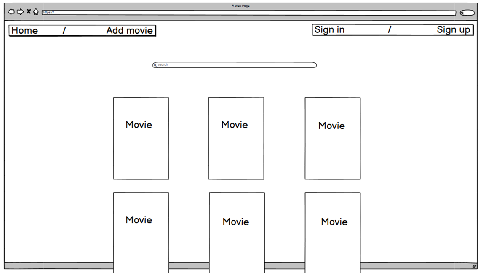

Movie detail and review page

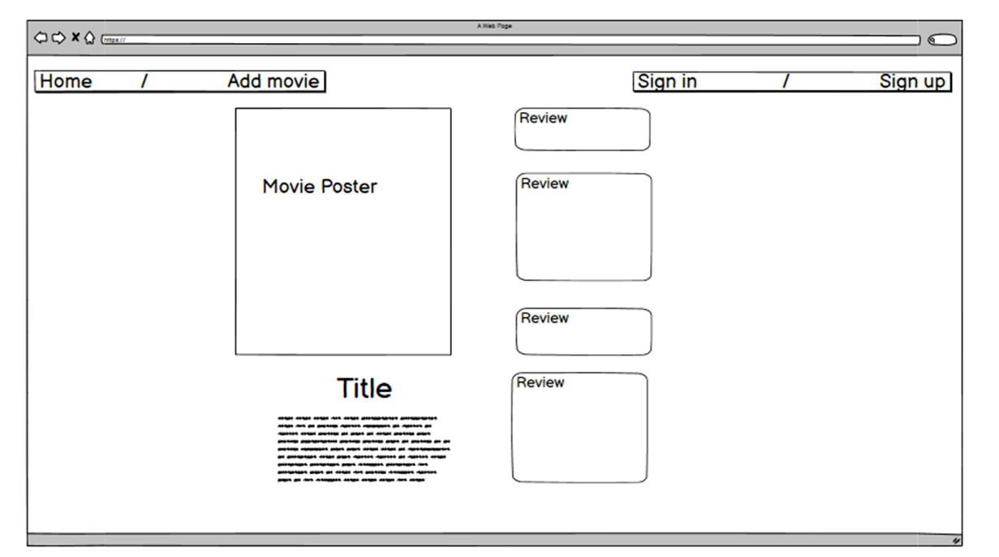

<br>
<br>

# Site Showcase / Features

Site showcase of what is shown as if through a typical user experience of the site.

### Users are greeted with this main page first

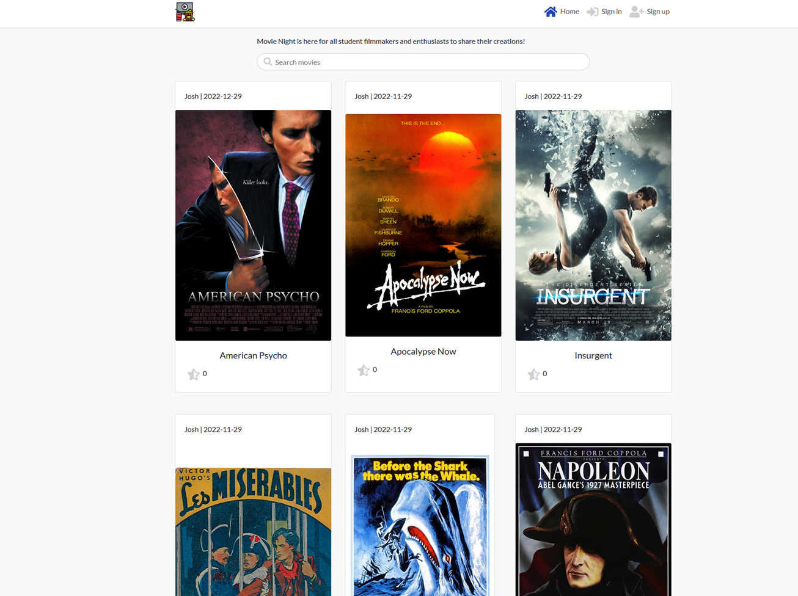

### Users can search for movies

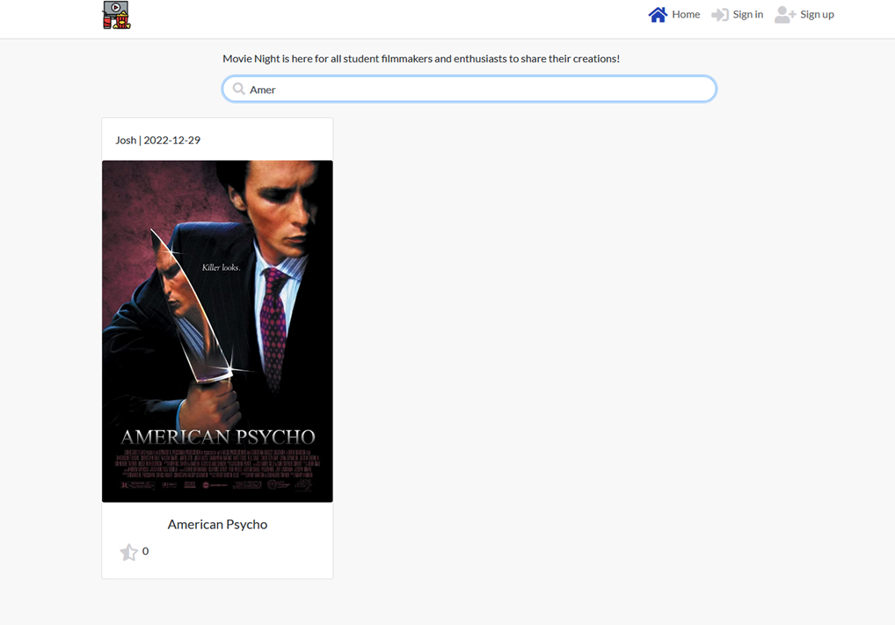

### Users can click on the movie poster to see more details

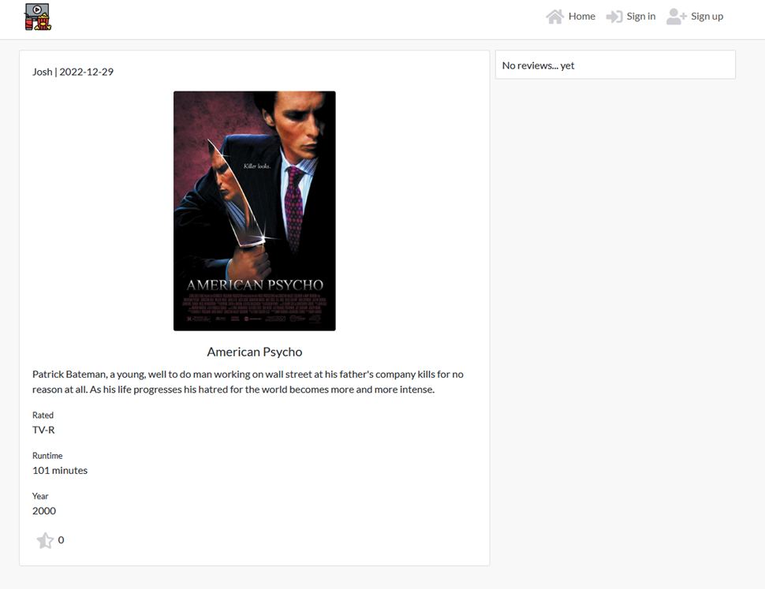

From this page, users can see reviews to the right of the movie details, there's none at the moment, so let's add one

First Users sign in from the link in the navigation bar.

The sign up and sign in pages are taken from the Moments walkthrough project, and the image was chosen to stay the same as I thought it went nicely with the site goals of bringing amateur and professional cinema and TV together. All credits go to the Code Institute for this and I passed it by my mentor and she agreed.

In the future I would like to change this image, and the logo to something custom made for the site.

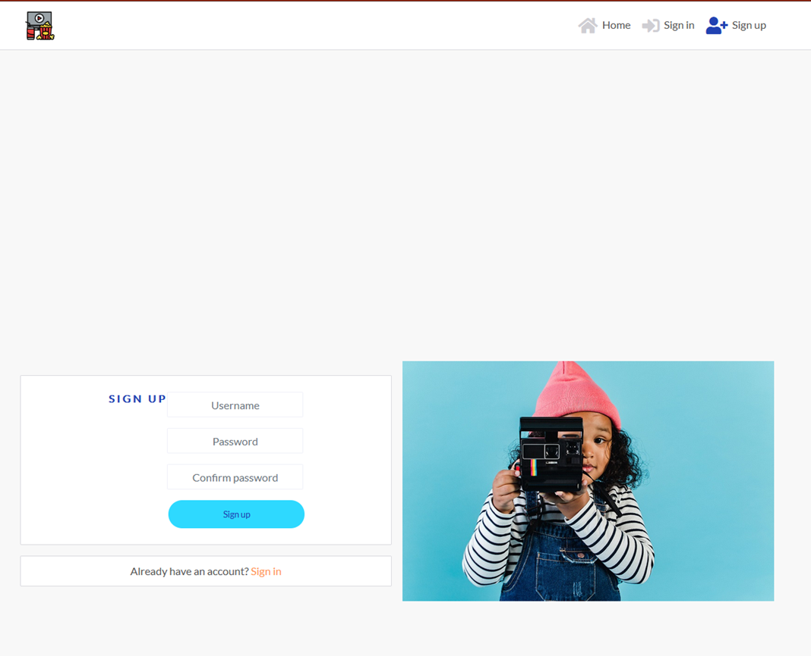

After signing up, users are prompted to sign in

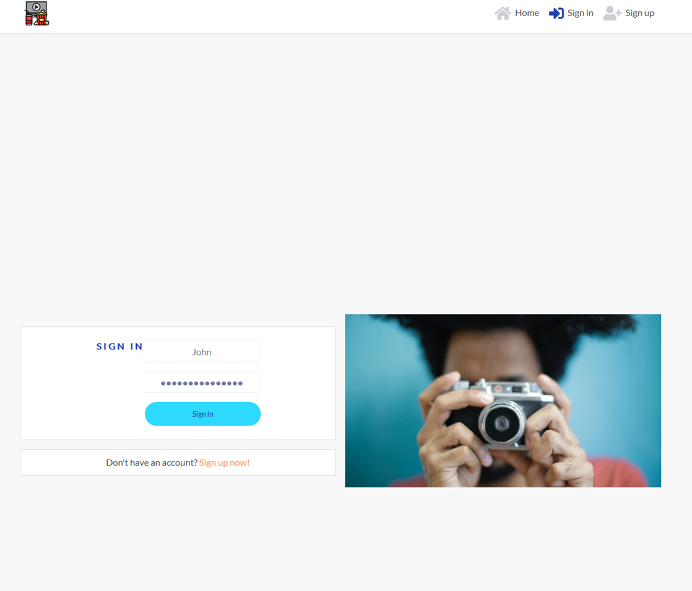

Users can now view the review form and can add reviews

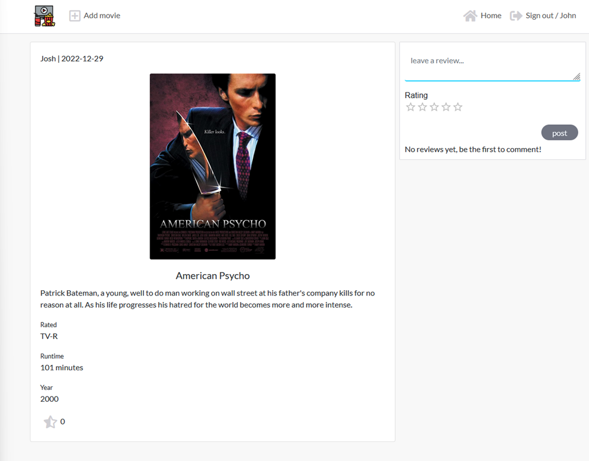

The new review can be viewed

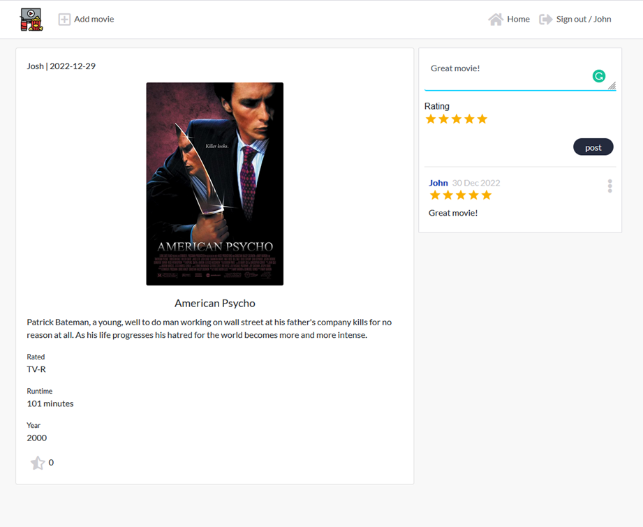

Users can also use the 'add a movie' button in the navigation bar once logged in to use the create movie form to add a movie

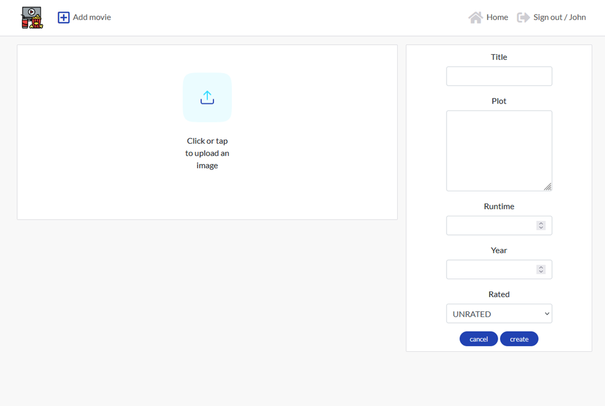

Users can also edit and delete the movies and reviews they add, by clicking the dropdown menu and then the icons for either edit or delete.

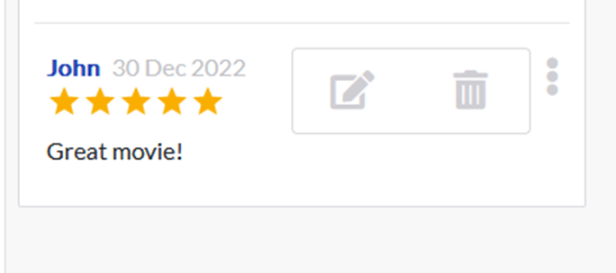

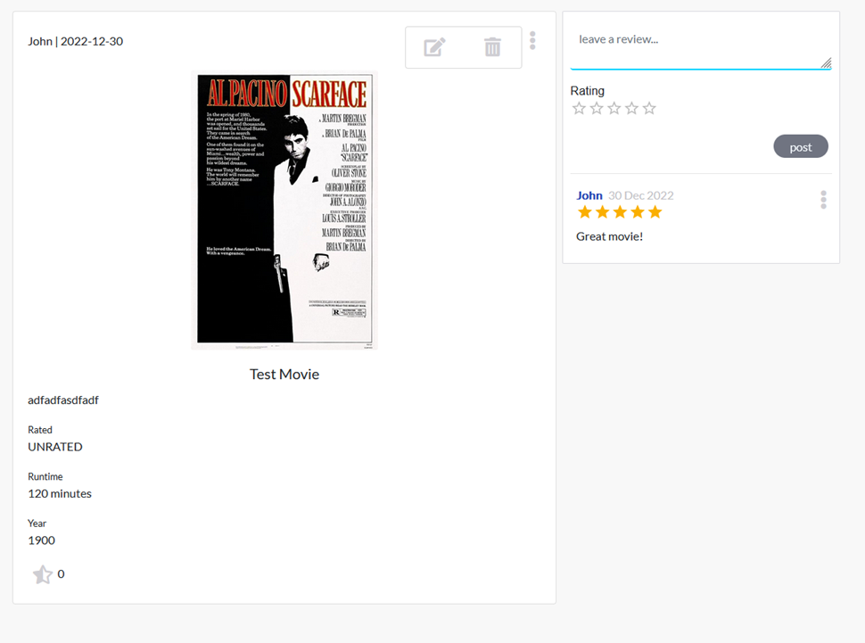

Finally, users can log out using the option in the navigation bar

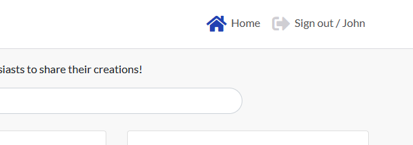

<br>
<br>

# Testing

## Manual Testing

All features in the site, as shown in the showcase above, have been tested.

- Users can sign up and create an account
- Users can log in
- Refresh tokens are obtained to keep sessions with the API actives to logged in users
- Users can log out
- Movies can be created by logged in users
- Movies can be edited and deleted by their owners
- Reviews can be created by logged in users
- Reviews can be edited and deleted by logged in users
- Users that are not logged in are redirected away from any url pathways that they should not be able to see
- Users that are logged in are redirected away from any url pathwayways that they shouold not be able to see

## Validator testing

### JavaScript (ESLint)

All custom JS code passes through [ESLint](https://eslint.org)

### Ignored errors
- Code from the Moments walkthrought project produced some errors
  - Such as  error "missing in props validation"
  - After looking into what other students have done with this, and that the errors pose major issue with the project they have been intentionally ignored

### CSS (W3C Jigsaw Validator)

All custom CSS code passes through the [W3C Jigsaw Validator](https://jigsaw.w3.org/css-validator/)

### Lighthouse

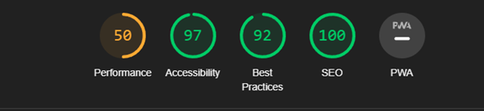

### Fixed Bugs
- Reviews CSS being misaligned to the top of the movie detail component
- Movie cards on the home page being the same height in rows/ columns irrelevant to poster size
- After users logged out, refresh tokens were seemingly still provided on a page refresh
 - This was actually my browser automatically logging me in with saved credentials each time and was fixed by using another browser (Mozilla Firefox) for development
- During final deployment, incompatible versions of ESLint were causing the app not to deploy
 - Fixed by removing ESLint before deployment, but after validator testing was completed
 - This was achieved by following Heroku's steps in the build logs by deleting package-lock.json, node_modules and the dependencies for ESLint in package.json and then running the command `npm install`

### Existing bugs
- Minor css misalignment of smaller screen sizes main movie home page
- Minor css misalignment on the sign up and sign in forms

### Missing Features / Future additions

- A last minute oversight, but dealing with too many reviews on one post at the moment is handled by an admin
 - It does not pose any issues to the site at present but needs to be changed in the future
 - Infinite scroll is a way to combat this, but currently reviews only show the most recent and not any past the page limit

# Technologies used

- HTML5
- CSS
- JavaScript

## Frameworks and libraries

- React, to build the components to display changing data
- Google Fonts, to use a font that fits the style of the site
- Font Awesome, to improve the icons for buttons and links
- Balsamiq, for wireframes to conceptualize the front end design
- Favicon, to get the icon for browser tabs
- React-bootstrap, to allow for bootstrap framework styles to assit with page structure and design
- React-router-dom, to provide conditional rendering based on url patterns
- Material UI, to provide an easy 'Rating' star component for reviews

## Components

- utils.js, utility for JWT timestamp decoding and addition/deletion of it from browser storage
- Asset.js, shows and image and a message for multiple purposes
- CurrentUserContext.js, a hook to get the currently logged in user
- useRedirects.js, a hook used to redirect users away from urls they shouldn't be able to see
- MoreDropdown.js, just for displaying the edit and delete dropdown icons and their functionality
- Navbar.js, the navigation bar for the site
- axiosDefaults.js, supplies the default url configurations for http requests used to communicate with the API

# Deployment

## Steps to deployment

1) Open the GitPod workspace
2) Install React using `npx create-react-app`
3) install these dependencies missing from this list using npm

```
      "dependencies": {
        "@emotion/react": "^11.10.5",
        "@emotion/styled": "^11.10.5",
        "@mui/material": "^5.11.2",
        "@testing-library/jest-dom": "^5.16.5",
        "@testing-library/react": "^11.2.7",
        "@testing-library/user-event": "^12.8.3",
        "axios": "^0.21.4",
        "bootstrap": "^4.6.2",
        "jwt-decode": "^3.1.2",
        "react": "^17.0.2",
        "react-bootstrap": "^1.6.6",
        "react-dom": "^17.0.2",
        "react-infinite-scroll-component": "^6.1.0",
        "react-router-dom": "^5.3.4",
        "react-scripts": "^4.0.3",
        "web-vitals": "^1.1.2"
      },
```

4) Add, commit and push changes to the repository
5) Open a Heroku app and scroll to 'GitHub' under the 'Deploy' tab
6) Click 'Deploy branch'

Steps to ensure a fully working front and back end with CORS authorisation are detailed in the [Back End Repository README.md file](https://github.com/JavaScriptJacksn/p5-api-movie)

# Credits

Code Institute
- Moments walkthrough project for a great base project to build upon and adapt
- The SignIn.js and SignUp.js components

Material UI
- For the 'Rating' component used to display a star rating in reviews and in the review form

Martina Terlevic
- For awesome mentorship and support :)

Stack Overflow
- It's almost a given at this point...

I have lost the sources to the image of the logo used in this project, but it was sourced from an online clip art website. 