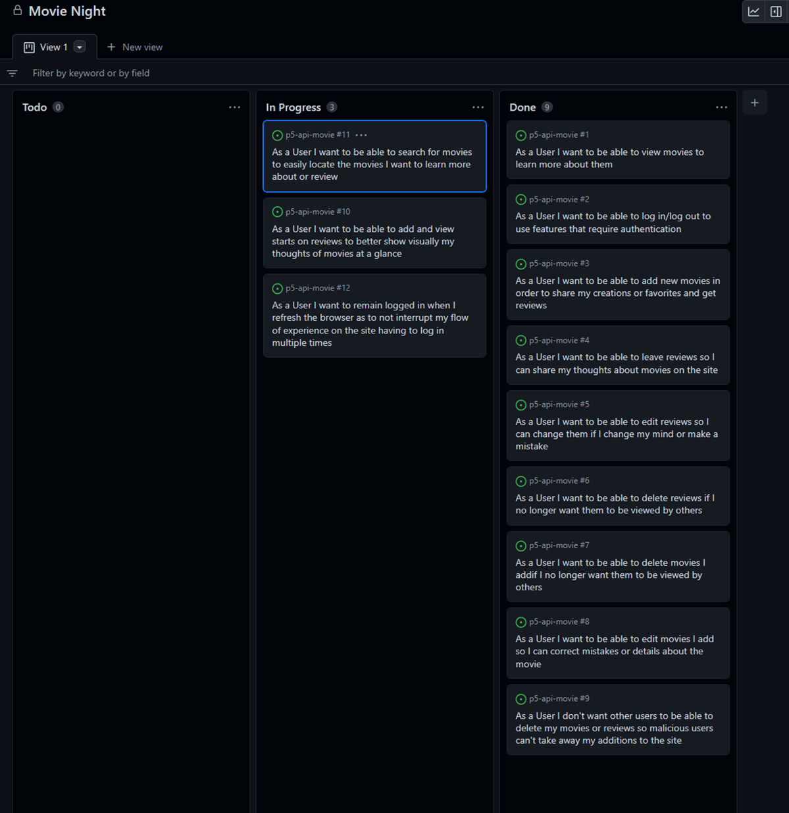

# Movie Night

Movie Night is a movie sharing and reviewing platform for student filmmakers, enthusiast or anyone to share movies or short peices of film to a wide audience for critique... and maybe a little ego bump for some.

[Deployed Front End](https://movie-night-p5.herokuapp.com)

All documentation for the API and database schema can be found int he README.md file in the repository below.

[Back End Repository](https://github.com/JavaScriptJacksn/p5-api-movie)

[Deployed Back End](https://drf-movie-app.herokuapp.com)

 
 

# UX

## Purpose

For users to share movies, scenes or extracts both professional and amateur for others to see and review.

In the future, I plan to encompass a wider range of features similarly to that of Imbd, but with more emphasis on an anyone-can-contribute such as Rotten Tomatos, yet with the added benefit of student/amateur movies being encouraged.

## Goal

Movie Night's goal is to facilitate professional, student and hobby filmmakers and critics to level the playing field with all levels of cinema and TV to communicate together. 

## Audience

Anyone with an interest in cinema, TV, filmmaking or critiquing.

## Communication

The site uses a minimalist approach to keep engagement towards the key movie content and reviews a priority.

## User Goals

To keep users enganged and always interested in new content that's easy to locate and understand with easy an sign up and sign in feature to allow new and returning users to quickly access movie and review creating fucntionality.

## Future Goals

To include user profiles, messaging and 'favourites' features.

# User Stories

# Design

Most of the UI design is build from the great foundations displated in the Code Institute Moments walkthough project, so full credit is given for the basis of the site layout. I found the Moments project served wonderfully as a base UI to work with along with the principles mentioned above. 

 
 

## Wireframes

Main movie page

Movie detail and review page

 
 

# Site Showcase / Features

Site showcase of what is shown as if through a typical user experience of the site.

### Users are greeted with this main page first

### Users can search for movies

### Users can click on the movie poster to see more details

From this page, users can see reviews to the right of the movie details, there's none at the moment, so let's add one

First Users sign in from the link in the navigation bar.

The sign up and sign in pages are taken from the Moments walkthrough project, and the image was chosen to stay the same as I thought it went nicely with the site goals of bringing amateur and professional cinema and TV together. All credits go to the Code Institute for this and I passed it by my mentor and she agreed.

In the future I would like to change this image, and the logo to something custom made for the site.

After signing up, users are prompted to sign in

Users can now view the review form and can add reviews

The new review can be viewed

Users can also use the 'add a movie' button in the navigation bar once logged in to use the create movie form to add a movie

Users can also edit and delete the movies and reviews they add, by clicking the dropdown menu and then the icons for either edit or delete.

Finally, users can log out using the option in the navigation bar

 
 

## Testing

### Manual Testing

All features in the site, as shown in the showcase above, have been tested.

- Users can sign up and create an account
- Users can log in
- Refresh tokens are obtained to keep sessions with the API actives to logged in users
- Users can log out
- Movies can be created by logged in users
- Movies can be edited and deleted by their owners
- Reviews can be created by logged in users
- Reviews can be edited and deleted by logged in users
- Users that are not logged in are redirected away from any url pathways that they should not be able to see
- Users that are logged in are redirected away from any url pathwayways that they shouold not be able to see

### Validator testing

all custom code good

Ignored errors

- Files from the Moments were ignored
- such as  error "missing in props validation"
- from research seems more of a bug with esLint but could be wrong, the errors cause no harm to the application

missing features - too many reviews etc an oversight in the final moments of finishing up the project- approaching dealine - does not cause any impact to the site at the current time, to be added later as admin can delete old reviews to show new ones until this gets added                    

known bugs :

review form content does not refresh after adding a review

log out and thenr still getting refresh token, was to do with browser auto logging back in

credits : moments, material UI, font awesome, google fonts